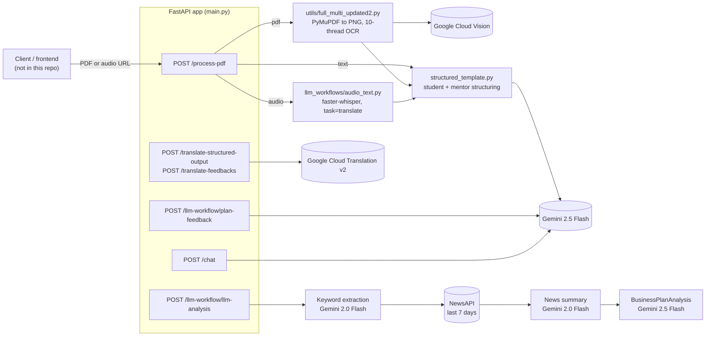

# SapnaForge

**Turns raw business ideas (handwritten plans and voice recordings in Indian languages) into structured, scored business plans with feedback a mentor or first-time founder can act on.**

Built by Team CODE SQUAD for CODE ODYSSEY 4.0, around the Tata STRIVE entrepreneurship programme for NEET (Not in Education, Employment, or Training) youth.

| | |
|---|---|
| Repository | https://github.com/Professional50coder/SapnaForge |
| Demo / presentation | [Canva presentation](https://www.canva.com/design/DAG0OU_USZw/pxSBp6gahvU1n4nB6LNiKQ/edit) |
| Write-up | [Our Hackathon Journey (LinkedIn)](https://www.linkedin.com/posts/hitanshgopani_hackathon-aiforgood-entrepreneurship-activity-7378766742342266880-Fsgf?utm_source=share&utm_medium=member_desktop&rcm=ACoAAD5kiSsBfHVgaC4_DoiKWj_-cKye_LnXU-I) |
| Hosted API | None. There is no deployed instance; the backend runs locally. |

**At a glance**

- A FastAPI backend that takes a PDF of a handwritten business plan or an audio recording, extracts the text (Google Cloud Vision OCR / faster-whisper), and returns the plan as a structured JSON object.
- Gemini 2.5 Flash, constrained by Pydantic schemas, scores the plan, lists strengths, weaknesses and red flags, and writes second-person improvement feedback. Recent news from NewsAPI is pulled in as market context.
- Every structured output can be translated into Indian languages with Google Cloud Translation, so feedback reaches the founder in the language they wrote or spoke in.

## Contents

1. [The problem we solve](#the-problem-we-solve)
2. [Why we built it](#why-we-built-it)
3. [What it does](#what-it-does)
4. [Use cases](#use-cases)
5. [Product tour](#product-tour)
6. [How it works](#how-it-works)
7. [Architecture](#architecture)
8. [Models and AI used](#models-and-ai-used)
9. [Design decisions](#design-decisions)
10. [Feature matrix](#feature-matrix)
11. [Trust, security and limits](#trust-security-and-limits)
12. [Where it stands](#where-it-stands)
13. [Tech stack](#tech-stack)
14. [Repository layout](#repository-layout)
15. [Running locally](#running-locally)
16. [Testing](#testing)
17. [Deploying](#deploying)
18. [Roadmap](#roadmap)
19. [Contributing, license and acknowledgments](#contributing)

---

## The problem we solve

Tata STRIVE helps NEET youth become entrepreneurs. The first review of each aspirant's idea is done by mentors, and that step does not scale:

- **Limited mentor bandwidth.** One-on-one mentorship does not scale to thousands of aspirants.
- **Language barriers.** Many youth express ideas in vernacular languages, not formal business English.
- **Raw ideas, structured need.** Viable concepts sit in handwritten notes and audio recordings that a reviewer has to read or listen to in full.
- **No first-line feedback.** There is no automated first pass that identifies and refines viable ideas before a mentor spends time on them.

## Why we built it

Every venture starts as a dream sketched on paper, spoken in conversation or scribbled in a notebook. For young entrepreneurs in rural and semi-urban India, those ideas often stay unexamined, not for lack of potential but for lack of structured guidance. *Sapna* means "dream"; SapnaForge reads an idea whether it is handwritten in Hindi, spoken in Tamil or sketched in Bengali, and shapes it into a structured proposal that a mentor can assess and the founder can improve.

The repository's sample data reflects that intake reality: a Tata STRIVE counsellor's phone call with an Entrepreneurship Development Program applicant in mixed Gujarati and Hindi, and handwritten Odia business-plan PDFs.

## What it does

| Capability | Problem it removes |
|---|---|
| OCR on handwritten/scanned PDF plans (Google Cloud Vision `document_text_detection`, 20 language hints including Hindi, Odia, Bengali, Tamil, Telugu, Malayalam, Kannada, Gujarati, Punjabi, Marathi, Assamese) | Ideas trapped in handwritten notes |
| Speech-to-text with automatic language detection and translation to English (faster-whisper) | Ideas trapped in voice recordings and phone calls |
| Structuring into a fixed `BusinessPlanDetails` schema, in a student view (second person) and a mentor view | Reviewers reading free-form text with no common shape |
| Section scores (0-10) on problem, solution, market, revenue, operations, funding, risk, impact | No consistent first-pass assessment |
| Full analysis (`BusinessPlanAnalysis`): feasibility scores (0-5) with rationale, strengths, weaknesses, red flags, prioritised actions, extracted KPIs, overall confidence | Mentors repeating foundational reviews |
| News context: Gemini extracts five keywords, NewsAPI returns last-7-day articles, Gemini summarises them into the analysis | Feedback that ignores the current market |
| Student feedback (`BusinessPlanFeedback`): level, completeness %, High/Medium/Low improvements, this-week steps, research tasks, questions, motivational note | Founders not knowing what to fix next |
| Translation of any structured output or feedback into a target language (Google Cloud Translation) | Feedback delivered only in English |
| Chat over a plan transcript (`/chat`) | Follow-up questions needing a mentor |

## Use cases

- **Programme intake.** A counsellor uploads a scanned plan or a call recording; the mentor receives a structured, scored summary instead of the raw file.
- **Founder self-improvement.** The aspirant gets second-person feedback with concrete next steps, translated into their language.
- **Mentor triage.** Section scores, red flags and overall confidence help mentors decide which ideas need a deep-dive session first.
- **Follow-up Q&A.** A mentor or founder asks questions about a specific plan through the chat endpoint.

## Product tour

This repository is the backend. The README's original architecture places a frontend (file upload, audio recording) and a mentor dashboard in front of it; that frontend is not in this repository. The demo is shown in the [Canva presentation](https://www.canva.com/design/DAG0OU_USZw/pxSBp6gahvU1n4nB6LNiKQ/edit).

The intended workflow:

1. The entrepreneur uploads a handwritten business plan (in Hindi, Tamil, Bengali or another language) or an audio recording.
2. SapnaForge extracts the text and structures the idea into JSON.
3. The AI analyses the business model, market viability and gaps.
4. Feedback is generated and translated into the entrepreneur's preferred language.
5. The mentor receives the structured plans, with scores, to prioritise deep-dive sessions.

The API is self-documenting: with the server running, FastAPI serves interactive docs at `http://localhost:8000/docs`.

## How it works

One end-to-end flow, a scanned handwritten plan:

1. **Submit.** The client calls `POST /process-pdf` with `{"url": "<pdf url>", "type": "pdf"}` (a single object or a list; only the first item is used).
2. **Download.** The server fetches the PDF with `requests` and writes it to the OCR working directory.
3. **Rasterise.** PyMuPDF renders each page to a 300 DPI PNG (`convert_pdf_to_images`).
4. **OCR in parallel.** A `ThreadPoolExecutor` with 10 workers sends pages to Google Cloud Vision `document_text_detection` with Indian-language hints. Each page returns `full_text`, `word_count`, `has_content` and a script-based language tag; images are deleted after OCR.
5. **Structure twice.** The page list is passed to Gemini 2.5 Flash (temperature 0) via LangChain `with_structured_output(BusinessPlanDetails)`, once with a student prompt (second person) and once with a mentor prompt.
6. **Respond.** The endpoint returns `transcribe` (the OCR JSON), `structured_data_student` and `structured_data_mentor`. The temporary PDF is removed.
7. **Analyse.** The client sends the text to `POST /llm-workflow/llm-analysis`. Gemini 2.0 Flash extracts five keywords, NewsAPI is queried for each, Gemini summarises the articles, and Gemini 2.5 Flash produces a `BusinessPlanAnalysis` that includes the news summary.
8. **Coach.** `POST /llm-workflow/plan-feedback` returns a `BusinessPlanFeedback` (temperature 0.3 for more varied wording).
9. **Localise.** `POST /translate-structured-output` or `POST /translate-feedbacks` with `{"...": ..., "language": "hindi"}` detects the source language and recursively translates every string in the JSON.

For `"type": "audio"` the route calls the faster-whisper pipeline instead of OCR. With any other type it falls back to the bundled sample transcript in `transcription_summary_20250927_194111.json`, for demos without OCR credentials or a GPU.

## Architecture



### Components

| Component | File | Responsibility |
|---|---|---|
| App entry | `main.py` | Creates the FastAPI app ("File Processing API" v1.0.0), loads `.env`, enables CORS (`*`), mounts the four routers |
| Ingestion router | `routers/pdf_process_api.py` | `POST /process-pdf`: download, OCR or ASR, then dual structuring |
| LLM router | `routers/llm_workflow_routes.py` | `/llm-workflow/plan-feedback`, `/llm-workflow/llm-analysis` |
| Translation router | `llm_workflows/multilin_structured_output.py` | `/translate-structured-output`, `/translate-feedbacks` |
| Chat router | `llm_workflows/chat_query.py` | `/chat`: answers a query against a transcript (Gemini 2.5 Flash, max 512 tokens) |
| OCR pipeline | `utils/full_multi_updated2.py` | PDF rasterisation, threaded Vision OCR, result saving; also runnable as a script |
| ASR pipeline | `llm_workflows/audio_text.py` | faster-whisper transcription/translation, SRT generation |
| Standalone ASR CLI | `subtitle_generator.py` | Same Whisper pipeline as a command-line tool |
| Structuring | `llm_workflows/structured_template.py` | Student and mentor prompts into `BusinessPlanDetails` |
| Analysis | `llm_workflows/LLM_analysis.py` | Keywords, news, summary, `BusinessPlanAnalysis` |
| Feedback | `llm_workflows/plan_feedback.py` | `BusinessPlanFeedback` and `ImprovementSuggestion` models and generation |
| Translation | `llm_workflows/google_translate_json.py` | Recursive JSON translation; maps language names (hindi, gujarati, odia, ...) to ISO codes |
| Schemas | `llm_workflows/schemas.py` | `BusinessPlanDetails`, `BusinessPlanAnalysis` |
| News prototype | `llm_workflows/summerries3.py` | Standalone script version of the news-summary step |

### Data and APIs

**Endpoints**

| Method and path | Request body | Response |
|---|---|---|
| `POST /process-pdf` | `{"url": str, "type": "pdf" \| "audio"}` or a list of them | `transcribe`, `structured_data_student`, `structured_data_mentor` |
| `POST /llm-workflow/llm-analysis` | `{"json_data": <string or {"json_data": ...}>}` | `BusinessPlanAnalysis` |
| `POST /llm-workflow/plan-feedback` | `{"json_data": <any>}` | `BusinessPlanFeedback` |
| `POST /translate-structured-output` | `{"structured_output": <any>, "language": str}` | `{"translated_output", "language"}` |
| `POST /translate-feedbacks` | `{"feedbacks": <any>, "language": str}` | `{"translated_feedbacks", "language"}` |
| `POST /chat` | `{"query": str, "transcription": str}` | `{"response": str}` |

**Core schemas** (`llm_workflows/schemas.py`, `llm_workflows/plan_feedback.py`)

- `BusinessPlanDetails`: title, tagline, vision, mission, language, stage, summary, and eight combined sections (problem and customer; solution and features; market and competitors; channels and revenue; operations and team; traction and funding; risks and mitigation; social and environmental impact), each with a 0-10 score.
- `BusinessPlanAnalysis`: overall confidence (0.0-1.0); seven 0-5 scores (problem and market, value and model, team and traction, funding readiness, market/financial/technical feasibility), each with a written basis; strengths, weaknesses, prioritised actions, red flags, risk assessment, automated feedback, extracted KPIs, news summary.
- `BusinessPlanFeedback`: submission id, timestamp, strength level (Beginner/Intermediate/Advanced), completeness (0-100), High/Medium/Low `ImprovementSuggestion` lists (section, priority, issue, action, why, resources), next steps this week, research assignments, questions to answer, what you are doing well, motivational note, estimated hours.

**Persistence.** None. Results are returned in the response; nothing is written to a database. `pymongo` is listed in `requirements.txt` but is not imported anywhere.

## Models and AI used

| Model | Where | Why |
|---|---|---|
| Gemini 2.5 Flash (`langchain-google-genai`) | Structuring, analysis, feedback, chat | Native structured output via `with_structured_output(PydanticModel)`, so responses are validated against the schemas; fast enough for interactive use |
| Gemini 2.0 Flash (`gemini-2.0-flash-exp`, `google-generativeai`) | Keyword extraction and news summarisation inside the analysis step | Light, plain-text tasks that do not need schema enforcement |
| faster-whisper (`large-v3-turbo` via `deepdml/faster-whisper-large-v3-turbo-ct2` by default in `audio_text.py`; `base` by default in `subtitle_generator.py`) | Audio intake | Runs locally on GPU (float16) or CPU (int8); `task="translate"` detects the spoken language and outputs English in one pass; VAD filtering removes silence. Falls back to `base` if the larger model fails to load |
| Google Cloud Vision `document_text_detection` | Handwritten/scanned PDF intake | Dense-document OCR with language hints for Indic scripts |
| Google Cloud Translation v2 | Output localisation | Deterministic translation of every string in a JSON tree without an LLM call; an earlier commit replaced LLM-based translation with this |

Temperatures: 0 for structuring and analysis (repeatable scoring), 0.3 for student feedback, 0.2 for chat.

## Design decisions

| Decision | Why | Trade-off |
|---|---|---|
| Pydantic schemas as the LLM output contract | Every downstream consumer (dashboard, translation, mentor view) gets the same shape; validation catches malformed output | Fields the model cannot fill come back `None`; schema changes require prompt and client changes |
| Two structuring passes (student and mentor) on the same text | Founders get second-person, encouraging language; mentors get a neutral summary | Two Gemini calls per upload, doubling cost and latency |
| Combined plan sections (eight blocks) instead of many granular fields | Handwritten plans rarely separate, say, "target customer" from "evidence of problem"; fewer fields means fewer empty ones | Less granular scoring |
| Parallel page OCR (10 threads) | Multi-page scanned plans are I/O-bound on the Vision API | Higher burst load against Vision rate limits |
| Whisper with `task="translate"` | One pass gives English text for analysis regardless of spoken language | The original-language transcript is not kept for the founder |
| Google Translate instead of an LLM for localisation | Faster, cheaper and does not paraphrase scores or field names | Translates every string, including values a client might want to keep in English |
| News grounding via NewsAPI | Gives the analysis current market context | Adds three external calls to every analysis; English-language news only; last 7 days only |
| Stateless API, no database | Simple to run for a hackathon | No history, no mentor queue, no audit trail |

## Feature matrix

| Feature | Status in code |
|---|---|
| PDF (handwritten/scanned) OCR | Implemented |
| Parallel multi-page OCR | Implemented |
| Audio transcription with language detection | Implemented as a script and module; see limits for the API path |
| Structured plan (student and mentor views) | Implemented |
| Section scoring (0-10) | Implemented |
| Full analysis with feasibility scores, red flags, KPIs | Implemented |
| News-grounded market context | Implemented |
| Student improvement feedback | Implemented |
| JSON translation into Indian languages | Implemented (11 Indian languages in the name map, plus English and several foreign languages; ISO codes are passed through) |
| Chat over a transcript | Implemented |
| Frontend / mentor dashboard | Not in this repository |
| Persistence / database | Not implemented |
| Authentication | Not implemented |
| Automated tests | None |

## Trust, security and limits

**Security**

- **Credentials.** Supply every key through environment variables (`GOOGLE_API_KEY`, `GEMINI_API_KEY`, `NEWS_API_KEY`); never commit them.
- **Service-account paths.** `utils/full_multi_updated2.py` and `llm_workflows/google_translate_json.py` point at a Google service-account JSON via absolute Windows paths. The JSON itself is excluded by `.gitignore`. On another machine these paths must be changed.
- **Open API.** No authentication; CORS allows all origins (`main.py` notes this must be configured for production).
- **Server-side fetch.** `/process-pdf` downloads any URL it is given. Do not expose it publicly without an allow-list.
- **Personal data.** Intake data includes names and phone numbers and is processed by Google Cloud and Gemini. Handle it under a data-protection policy and obtain consent before recording calls.

**Known limits**

- The app imports the OCR module at startup, and that module calls `exit()` if the service-account file cannot be loaded, so the server will not start without Vision credentials.
- The audio branch of `/process-pdf` passes the URL to `generate_subtitles`, which expects a local file path and returns a tuple. As written, remote audio URLs fail; the audio pipeline works when run directly on a local file.
- The PDF branch writes the downloaded file into `pdf_output_threaded/` before that directory is created; create it once before the first request.
- The page language tag only distinguishes Odia script from Latin script.
- Translation skips work only when the detected source code equals the `language` value exactly, so passing a name (`"hindi"`) rather than a code (`"hi"`) always triggers translation.
- `requirements.txt` is incomplete (see [Running locally](#running-locally)).
- Scores are LLM judgements, not validated against outcomes. They are a first-pass aid for mentors, not a funding decision.

## Where it stands

A hackathon MVP built for CODE ODYSSEY 4.0 (the team reports reaching the finals). The backend pipelines for OCR, transcription, structuring, analysis, feedback, translation and chat are implemented and wired into a FastAPI app. The frontend and dashboard shown in the presentation are not in this repository, nothing is deployed, and there are no tests.

## Tech stack

| Layer | Technology |
|---|---|
| Language | Python 3.8+ |
| API | FastAPI, Uvicorn, Pydantic, python-multipart |
| LLM | Google Gemini via `langchain-google-genai` and `google-generativeai` |
| OCR | Google Cloud Vision API, PyMuPDF |
| Speech-to-text | faster-whisper, PyTorch (CUDA optional), FFmpeg |
| Translation | Google Cloud Translation API (v2) |
| News | NewsAPI |
| Cloud | Google Cloud Platform |

The original README also listed Tesseract, Google Cloud Speech-to-Text, GPT-4 and Flask as options; none of these is used in the current code. `SpeechRecognition`, `pydub` and `pymongo` are in `requirements.txt` but not imported.

## Repository layout

```
SapnaForge/
├── main.py                         # FastAPI app; mounts all routers
├── requirements.txt
├── subtitle_generator.py           # Standalone faster-whisper CLI
├── routers/
│   ├── pdf_process_api.py          # POST /process-pdf
│   └── llm_workflow_routes.py      # /llm-workflow/plan-feedback, /llm-workflow/llm-analysis
├── llm_workflows/
│   ├── schemas.py                  # BusinessPlanDetails, BusinessPlanAnalysis
│   ├── structured_template.py      # Student and mentor structuring
│   ├── LLM_analysis.py             # Keywords, news, analysis
│   ├── plan_feedback.py            # BusinessPlanFeedback
│   ├── chat_query.py               # POST /chat
│   ├── multilin_structured_output.py  # Translation endpoints
│   ├── google_translate_json.py    # Recursive JSON translator
│   ├── audio_text.py               # Whisper pipeline used by the API
│   └── summerries3.py              # Standalone news-summary script
├── utils/
│   └── full_multi_updated2.py      # PDF to images, threaded Vision OCR
├── generated_subtitles/            # Sample SRT output
├── outputs/                        # Sample processing result
└── transcription_summary_20250927_194111.json  # Sample transcript (fallback input)
```

## Running locally

### Prerequisites

- Python 3.8+
- A GCP account (the team used the $300 free-tier credits) with the Vision and Translation APIs enabled, and a service-account JSON
- API keys: Google/Gemini (`GOOGLE_API_KEY`, `GEMINI_API_KEY`) and NewsAPI (`NEWS_API_KEY`)
- FFmpeg, for audio
- Optional: a CUDA GPU for faster Whisper transcription

### Installation

1. **Clone the repository**
```bash
git clone https://github.com/Professional50coder/SapnaForge.git
cd SapnaForge
```

2. **Set up a virtual environment**
```bash
python -m venv venv
source venv/bin/activate  # On Windows: venv\Scripts\activate
```

3. **Install dependencies**
```bash
pip install -r requirements.txt
# Imported by the code but missing from requirements.txt:
pip install python-dotenv requests google-generativeai google-cloud-vision google-cloud-translate faster-whisper torch tqdm
```

4. **Configure environment variables.** There is no `.env.example` in the repository; create `.env` in the project root:
```bash
GOOGLE_API_KEY=...
GEMINI_API_KEY=...
NEWS_API_KEY=...
```
Then set `SERVICE_ACCOUNT_JSON` in `utils/full_multi_updated2.py` and `GOOGLE_APPLICATION_CREDENTIALS` in `llm_workflows/google_translate_json.py` to your service-account JSON path, and create the OCR working directory:
```bash
mkdir pdf_output_threaded
```

5. **Run the application.** `main.py` defines `app` but has no `__main__` block (the original README's `python app.py` refers to a file that does not exist). Start it with Uvicorn:
```bash
uvicorn main:app --reload
```
Open `http://localhost:8000/docs` for the interactive API.

### Standalone scripts

```bash
# Transcribe and translate a local audio file to English SRT
python subtitle_generator.py path/to/audio.m4a -m base -o ./generated_subtitles
python llm_workflows/audio_text.py --audio path/to/audio.m4a --model large-v3-turbo

# OCR a local PDF (edit PDF_PATH in the file first)
python utils/full_multi_updated2.py
```

## Testing

There is no automated test suite. Manual checks:

```bash
# Structuring from the bundled sample transcript (any type other than pdf/audio uses the fallback)
curl -X POST http://localhost:8000/process-pdf -H "Content-Type: application/json" \
  -d '{"url": "x", "type": "text"}'

# Feedback on free text
curl -X POST http://localhost:8000/llm-workflow/plan-feedback -H "Content-Type: application/json" \
  -d '{"json_data": "I want to open a fast-food stall near my village market..."}'

# Translate a structured object to Hindi
curl -X POST http://localhost:8000/translate-structured-output -H "Content-Type: application/json" \
  -d '{"structured_output": {"title": "Metal fabrication shop"}, "language": "hindi"}'
```

`llm_workflows/google_translate_json.py` contains a sample plan in its `__main__` block that can be run directly to check translation.

## Deploying

No deployment configuration (Dockerfile, CI, cloud manifests) is committed. Before deploying the API anywhere:

1. Read all secrets from the environment.
2. Replace the absolute service-account paths with an environment variable or workload identity.
3. Restrict CORS and add authentication.
4. Add a URL allow-list to `/process-pdf`.
5. Complete `requirements.txt` and pin versions. Audio needs FFmpeg in the image, and a GPU if `large-v3-turbo` latency matters.

## Roadmap

The original plan, with status checked against the code in this repository:

| Phase | Item | Status in this repo |
|---|---|---|
| 1: MVP | OCR for handwritten notes | Done |
| 1: MVP | Audio transcription | Done (module/CLI; API path needs the fix noted in limits) |
| 1: MVP | Basic LLM analysis | Done |
| 1: MVP | Dashboard prototype | Marked done in the original README; not in this repo |
| 2: Enhancement (Q1 2025) | Advanced multi-language support (15+ Indian languages) | Marked done; the code's translation map names 11 Indian languages, other ISO codes pass through |
| 2: Enhancement | Real-time processing optimisation | Marked done; threaded OCR is present |
| 2: Enhancement | Mentor recommendation engine | Marked done; not found in this repo |
| 2: Enhancement | Adaptive learning paths | Marked done; not found in this repo |
| 3: Scale (Q2 2025) | Integration with government schemes (Startup India, MUDRA) | Planned |
| 3: Scale | Industry partner ecosystem | Planned |
| 3: Scale | Mobile app | Planned |
| 3: Scale | Offline mode for low-connectivity areas | Planned |
| 4: Intelligence (Q3 2025) | Predictive success scoring | Planned |
| 4: Intelligence | Peer learning network | Planned |
| 4: Intelligence | Market trend analysis | Planned (news-based context exists) |
| 4: Intelligence | Automated pitch deck generation | Planned |

Engineering items that follow from the limits above: secret management, a working remote-audio path, persistence for a mentor queue, authentication, and tests.

---

## Contributing

Contributions are welcome, whether bug fixes, features or documentation.

1. Fork the repository
2. Create your feature branch (`git checkout -b feature/AmazingFeature`)
3. Commit your changes (`git commit -m 'Add some AmazingFeature'`)
4. Push to the branch (`git push origin feature/AmazingFeature`)
5. Open a Pull Request

## License

The project is stated to be under the MIT License. No `LICENSE` file is committed yet; add one before relying on that grant.

## Acknowledgments

- **Tata STRIVE**, for the opportunity to work on a problem affecting thousands of young entrepreneurs
- **CODE ODYSSEY 4.0**, for the platform
- **Google Cloud Platform**, for the infrastructure and credits
- **Our mentors**, whose work inspired this solution

## Team

**Team CODE SQUAD**: building technology that doesn't just scale, but cares.

- Project: https://github.com/Professional50coder/SapnaForge
- Demo: [Canva presentation](https://www.canva.com/design/DAG0OU_USZw/pxSBp6gahvU1n4nB6LNiKQ/edit)

*"Every entrepreneur deserves a fair chance."*
