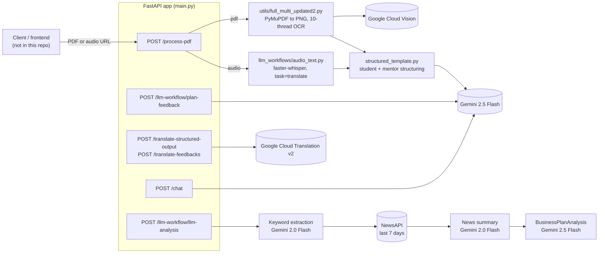

# SapnaForge 🌱

**Turn a handwritten business plan or a voice note, in an Indian language, into a structured, scored plan that a mentor can triage in minutes and a first-time founder can act on.**

[](https://github.com/Professional50coder/SapnaForge/actions/workflows/ci.yml)


[](LICENSE)

*Sapna* means "dream". SapnaForge is the backend of a **Code Odyssey hackathon project** built by Team CODE SQUAD around the Tata STRIVE entrepreneurship programme for NEET youth. It is a working **prototype**, not a hosted product: there is no frontend in this repo, no deployment, and no accuracy benchmark (see [Limitations](#limitations-and-roadmap)).

[Presentation (Canva)](https://www.canva.com/design/DAG0OU_USZw/pxSBp6gahvU1n4nB6LNiKQ/edit) · [Write-up (LinkedIn)](https://www.linkedin.com/posts/hitanshgopani_hackathon-aiforgood-entrepreneurship-activity-7378766742342266880-Fsgf)

---

## Why it exists

Mentors in an entrepreneurship programme cannot read or listen to every raw idea in full. Many ideas live in handwritten notes (Hindi, Odia, Bengali, Tamil ...) or in phone calls, and are never reviewed. SapnaForge is the **first-pass reviewer** that sits in front of the mentor:

| Input | What comes out |
|---|---|
| Scanned/handwritten **PDF** | OCR text, plus the plan in a fixed schema (8 sections, each scored 0-10) in a *student* (second-person) view and a neutral *mentor* view |
| **Audio** recording (any spoken language) | English transcript (Whisper), then the same structured plan |
| Plan text | A scored analysis with red flags and prioritised actions (grounded in recent news if a NewsAPI key is set), student feedback with next steps, a chat endpoint, and translation of any output into Indian languages |

## See it work (no keys needed)

A real structured plan from the repo's own data (a handwritten Odia plan for a metal-fabrication shop) is checked against the output schema, and the gaps a mentor would ask about are listed:

```console
$ python examples/inspect_plan.py
Plan: SATYABHAMA FABRICATION  (language: English and Odia)
Sections filled: 6/8
  [x] problem_and_customer
  [x] solution_and_features
  [x] market_and_competitors
  [x] channels_and_revenue
  [x] operations_and_team
  [x] traction_and_funding
  [ ] risks_and_mitigation  <- ask the founder
  [ ] social_and_environmental_impact  <- ask the founder
Mean section score: n/a (plan has no scores yet)
```

Committed copies: [`examples/sample_plan.json`](examples/sample_plan.json) (input) and [`examples/sample_plan_report.txt`](examples/sample_plan_report.txt) (this output). The sample plan is data taken from the project's translation demo, not a fresh model run; the scoring and feedback endpoints need a Gemini key to produce new output.

## Quickstart

Five commands, offline, verifies the install and the core logic:

```bash
git clone https://github.com/Professional50coder/SapnaForge && cd SapnaForge
python -m venv venv && source venv/bin/activate      # Windows: venv\Scripts\activate
pip install -r requirements-dev.txt
python -m pytest -q                                   # 29 tests, no credentials needed
python examples/inspect_plan.py
```

**Run the API** (the server starts without any cloud credentials; endpoints that need a service tell you which key is missing):

```bash
pip install -r requirements.txt            # full stack: Vision, Translate, Gemini, PyMuPDF
cp .env.example .env                       # then fill in the keys you have
uvicorn main:app --reload                  # interactive docs at http://localhost:8000/docs
```

Audio intake is optional: `pip install -r requirements-audio.txt` and install FFmpeg.

### Configuration (`.env.example`)

| Variable | Needed for | If missing |
|---|---|---|
| `GOOGLE_API_KEY` | Structuring, analysis, feedback, chat (Gemini 2.5 Flash) | Those endpoints return a clear error naming the key |
| `GEMINI_API_KEY` | Keyword and news-summary step | Falls back to `GOOGLE_API_KEY` |
| `NEWS_API_KEY` | News context in `/llm-workflow/llm-analysis` | News step is skipped; analysis still runs |
| `GOOGLE_APPLICATION_CREDENTIALS` | Path to a service-account JSON with Vision and Translation enabled | PDF OCR and translation endpoints fail with a clear error |
| `OCR_OUTPUT_DIR` | Scratch dir for page images | Defaults to `pdf_output_threaded` |

## API reference

| Method and path | Request body | Response |
|---|---|---|
| `POST /process-pdf` | `{"url": "<http(s) url>", "type": "pdf" \| "audio"}` (or a list; first item used) | `transcribe`, `structured_data_student`, `structured_data_mentor` |
| `POST /llm-workflow/llm-analysis` | `{"json_data": <string or JSON>}` | `BusinessPlanAnalysis` |
| `POST /llm-workflow/plan-feedback` | `{"json_data": <any>}` | `BusinessPlanFeedback` |
| `POST /translate-structured-output` | `{"structured_output": <any>, "language": "hindi"}` | `{"translated_output", "language"}` |
| `POST /translate-feedbacks` | `{"feedbacks": <any>, "language": "hindi"}` | `{"translated_feedbacks", "language"}` |
| `POST /chat` | `{"query": str, "transcription": str}` | `{"response": str}` |

Any other `type` on `/process-pdf` uses the bundled sample call transcript (`transcription_summary_20250927_194111.json`), which lets you try structuring without OCR or audio. It still needs `GOOGLE_API_KEY`.

```bash
curl -X POST localhost:8000/process-pdf -H "Content-Type: application/json" -d '{"url":"demo","type":"text"}'
curl -X POST localhost:8000/translate-structured-output -H "Content-Type: application/json" \
     -d '{"structured_output": {"title": "Metal fabrication shop"}, "language": "hindi"}'
```

**Schemas** (`llm_workflows/`)

- `BusinessPlanDetails`: title, tagline, vision, mission, language, stage, summary and eight combined sections (problem and customer; solution and features; market and competitors; channels and revenue; operations and team; traction and funding; risks and mitigation; social and environmental impact), each with a 0-10 score.
- `BusinessPlanAnalysis`: overall confidence (0-1); seven 0-5 scores (problem and market, value and model, team and traction, funding readiness, market/financial/technical feasibility) with written basis; strengths, weaknesses, prioritised actions, red flags, risk assessment, extracted KPIs, news summary.
- `BusinessPlanFeedback`: strength level, completeness %, High/Medium/Low improvements (section, issue, action, why, resources), steps for this week, research tasks, questions, what you are doing well, motivational note, estimated hours.

## Architecture



The PDF flow: download (http/https only) → PyMuPDF renders each page at 300 DPI → pages go to Vision `document_text_detection` in a 10-worker thread pool with 20 language hints (Hindi, Odia, Bengali, Tamil, Telugu, Malayalam, Kannada, Gujarati, Punjabi, Marathi, Assamese and others) → page text is structured twice by Gemini 2.5 Flash (temperature 0) via `with_structured_output(BusinessPlanDetails)`, once per audience.

## Measured results

| What | Result | Reproduce |
|---|---|---|
| Offline test suite | 29 passed (Python 3.14.5 locally; CI runs 3.11 and 3.12) | `python -m pytest -q` |
| Server starts with no cloud credentials | `/docs` returns 200; missing-key errors are explicit | `uvicorn main:app` |
| OCR / transcription / scoring accuracy | **Not measured.** No labelled dataset or benchmark exists in this repo | n/a |

The tests cover translation (name-to-code mapping, structure preservation, the same-language skip, failure fallback), SRT formatting, OCR helpers, schema range checks, plan-coverage logic, URL validation and API wiring. Gemini, Vision, Translate and NewsAPI are never called.

## Repository layout

```
SapnaForge/
├── main.py                          # FastAPI app; mounts the routers
├── routers/
│   ├── pdf_process_api.py           # POST /process-pdf (download, OCR or ASR, dual structuring)
│   └── llm_workflow_routes.py       # /llm-workflow/llm-analysis, /plan-feedback
├── llm_workflows/
│   ├── llm.py                       # one Gemini factory, reads GOOGLE_API_KEY
│   ├── schemas.py                   # BusinessPlanDetails, BusinessPlanAnalysis
│   ├── structured_template.py       # student and mentor prompts
│   ├── LLM_analysis.py              # keywords, news, analysis
│   ├── plan_feedback.py             # BusinessPlanFeedback
│   ├── text_utils.py                # pure helpers: keywords, KPIs, section coverage
│   ├── chat_query.py                # POST /chat
│   ├── multilin_structured_output.py# translation endpoints
│   ├── google_translate_json.py     # recursive JSON translator
│   ├── audio_text.py                # faster-whisper pipeline used by the API
│   └── summerries3.py               # standalone news-summary script
├── utils/full_multi_updated2.py     # PDF to images, threaded Vision OCR (also a CLI)
├── subtitle_generator.py            # standalone Whisper subtitle CLI
├── tests/                           # 29 offline tests
├── examples/                        # sample plan, inspect_plan.py, its committed output
├── generated_subtitles/             # sample SRT
├── transcription_summary_*.json     # sample call transcript (fallback input)
├── requirements.txt / -audio.txt / -dev.txt
├── .env.example
└── .github/workflows/ci.yml
```

Standalone scripts:

```bash
python utils/full_multi_updated2.py path/to/plan.pdf                     # OCR only
python subtitle_generator.py path/to/audio.m4a -m base -o ./generated_subtitles
python llm_workflows/audio_text.py --audio path/to/audio.m4a --model large-v3-turbo
```

## Design decisions

| Decision | Why | Trade-off |
|---|---|---|
| Pydantic schemas as the LLM contract (`with_structured_output`) | Every consumer gets the same shape; malformed output fails validation | Unfillable fields come back `None`; schema changes touch prompts and clients |
| Two structuring passes (student, mentor) | Founders get second-person encouragement; mentors a neutral summary | Two Gemini calls per upload |
| Eight combined sections instead of many granular fields | Handwritten plans rarely separate "target customer" from "evidence of problem" | Coarser scoring |
| Parallel page OCR (10 threads) | Multi-page scans are I/O-bound on the Vision API | Burst load against rate limits |
| Whisper `task="translate"` | One pass gives English text for analysis, whatever was spoken | The original-language transcript is not kept |
| Google Translate instead of an LLM for localisation | Deterministic, cheaper, does not paraphrase field names or scores | Translates every string, including ones a client may want in English |
| News grounding is optional | Adds market context when a key exists; analysis never depends on it | English-language news, last 7 days only |
| Lazy imports of cloud/ML packages | The app, tests and CI run without Vision, Whisper or langchain installed | Missing-package errors surface at first use |
| Stateless, no database | Simple for a hackathon | No history, mentor queue or audit trail |

## Stack

| Layer | Technology |
|---|---|
| API | FastAPI, Uvicorn, Pydantic |
| LLM | Gemini 2.5 Flash via `langchain-google-genai`; Gemini 2.0 Flash via `google-generativeai` for keywords and news summary |
| OCR | Google Cloud Vision, PyMuPDF |
| Speech | faster-whisper (`base` model when called from the API; `large-v3-turbo` is the default of the `audio_text.py` CLI), PyTorch, FFmpeg |
| Translation / news | Google Cloud Translation v2, NewsAPI |
| Quality | pytest, GitHub Actions |

## Limitations and roadmap

**Honest status.** This is a hackathon prototype. The full pipeline (Vision, Gemini, Translate, Whisper) was not re-run end to end while preparing this cleanup because it needs paid credentials; what is verified is the offline logic, the API wiring and server start-up (see [Measured results](#measured-results)). The pinned ranges in `requirements.txt` resolve on Python 3.14 but the newest `langchain-google-genai` major was not exercised.

**Known limits**

- Scores are LLM judgements, not validated against mentor decisions or outcomes. They are a first-pass aid, not a funding decision.
- No authentication, and CORS allows all origins (`main.py`). `/process-pdf` fetches any http(s) URL it is given; add an allow-list and block private address ranges before exposing it.
- The page-language tag only tells Odia script from Latin script.
- No persistence, no frontend or mentor dashboard, no deployment config.
- Intake data (names, phone numbers) goes to Google Cloud and Gemini; get consent and follow a data-protection policy. The bundled sample call contains real first names from an intake call; replace it before reuse.
- Credentials from earlier commits: API keys were hardcoded in earlier history and have been removed from the code. If you forked before this cleanup, treat them as exposed.

**Next steps (engineering)**: private-address blocking and auth on `/process-pdf`; a labelled set of plans to measure OCR and structuring quality; persistence for a mentor queue; Dockerfile with FFmpeg; contract tests for the Gemini calls.

**Product ideas from the original plan (not built)**: government-scheme matching (Startup India, MUDRA), mobile and offline mode, mentor recommendation, predictive success scoring, pitch-deck generation.

## Contributing

Fork, branch, run `python -m pytest -q`, open a pull request.

## License

[MIT](LICENSE) © Hitansh Gopani

## Acknowledgments

Tata STRIVE for the problem space, Code Odyssey for the platform, Google Cloud for credits, and our mentors. Built by Team CODE SQUAD.
